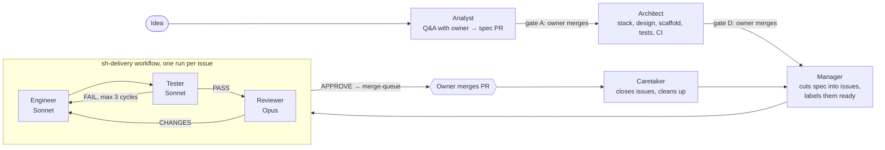

# sh-skills — an autonomous software house on Claude Code

A set of Claude Code skills that act as the roles of a small software team, orchestrated by
[Cezar](https://github.com/open-mercato/cezar), an open-source agent framework by Open Mercato.
I describe an idea; the agents write the spec, design the architecture, cut the work into issues,
and implement, test and review every issue. My job is answering the analyst's questions and
merging PRs on GitHub. I can step in on any PR with my own comments.

**Example output:** [cieyhomelab/kulki](https://github.com/cieyhomelab/kulki), a browser
puzzle game built by this pipeline in two days, through 42 merged PRs
([play it](https://cieyhomelab.github.io/kulki/)).

## How it works



| Skill | Role |
| --- | --- |
| `sh-analityk` (analyst) | Interviews the owner about a new idea or a gap in the spec, writes the functional spec and opens a PR. Merging it is gate A. Runs interactively only. |
| `sh-architekt` (architect) | After the spec is approved, picks the tech stack, adds the technical part of the spec, and scaffolds the app, tests, CI and agent pipeline. Its PR must pass gate D. |
| `sh-kierownik` (manager) | One manager for all projects. Cuts the approved spec into issues, tracks dependencies, prioritises bugs, and releases work to Cezar's queue with the `ready` label, in priority order across projects. |
| `sh-inzynier` (engineer) | First step of `sh-delivery`. Turns an issue into a PR, resumes a PR interrupted by a restart, and applies fixes from the tester's report, the reviewer's verdict or the owner's comments. |
| `sh-tester` (tester) | Second step. Runs the full test suite on a temporary instance, adds missing E2E tests for the acceptance criteria, and records PASS or FAIL. Never changes application logic. |
| `sh-reviewer` (reviewer) | Last agent step. Reviews the PR independently on a **different model than the engineer**, blocks only for serious problems, never fixes code itself. Records APPROVE or CHANGES. |
| `sh-opiekun` (caretaker) | Runs after a PR is merged or closed. Closes resolved issues, tidies labels, deletes merged branches and E2E leftovers, so the manager sees the real state. |
| `sh-start` | One-time repository setup: Cezar config, workflow, labels and automations. In the `sh-control` repo it sets up the hourly sweep across all projects. |

### Design decisions

- **Human gates, not human steps.** The owner only merges: the spec (gate A), the architecture
  and every code PR (gate D). Everything between gates runs unattended.
- **Independent review.** The reviewer runs on a different model from the engineer, so the code
  is not grading itself. Tester and reviewer verdicts are written to files and checked by shell
  gates in the workflow, not trusted from the agent's own summary.
- **Bounded retries.** A PR that fails tests or review goes back to the engineer at most three
  times; after that it gets the `blocked` label, a comment with options and a recommendation, and
  a push notification to the owner.
- **Labels as the state machine.** `ready`, `merge-queue`, `do-poprawki` (owner's fix request),
  `changes-requested`, `blocked`, `spec-gap` drive the whole flow and are visible on GitHub.
- **Improved from real sessions.** Every Cezar and Claude Code session is logged and periodically
  analysed to find where agents waste tokens or lose context; the skills are rewritten based on
  that.

> The skill files themselves are written in Polish, my working language with the agents.

## Installation

Five steps: steps 1, 2 and 5 are done once; steps 3 and 4 in every new project.

1. **Skills repository.** This repository holds the `skills/` and `workflows/` directories, laid
   out the same way as [`open-mercato/skills`](https://github.com/open-mercato/skills).
2. **Open Mercato skills for Claude Code on the VPS.** The `sh-*` skills call the `om-*` skills,
   so the agent needs them. Run the command below on the VPS and choose the global installation
   for Claude Code when asked.

   ```bash
   npx skills add open-mercato/skills --skill '*'
   ```

3. **`sh-*` skills installed globally on the VPS.** Cezar sees skills from `~/.claude/skills` in
   every project, including a freshly registered one with no configuration yet. Run this on the
   VPS as the user Cezar runs under, then click Refresh in the Skills tab. No
   `.ai/cezar/config.json` is needed.

   ```bash
   gh repo clone cieyhomelab/sh-skills ~/sh-skills
   mkdir -p ~/.claude/skills
   for d in ~/sh-skills/skills/*/; do ln -sfn "$d" ~/.claude/skills/$(basename "$d"); done
   ```

   To update after changes to the skills: `git -C ~/sh-skills pull`. When a new skill is added,
   run the `for` loop again.

4. **Workflow.** Copy `workflows/sh-delivery.yml` to `.ai/cezar/workflows/` in the project
   repository, or import it in Cezar's Workflows tab.
5. **Resources.** In Cezar: Settings → Resources, 3 parallel tasks and a 5000 MB memory limit
   per task. On the VPS: install Docker and add 8 GB of swap.

## Running with automation

Once configured, your role is the idea, the answers in the Q&A and the merges. Cezar's
automations and the hourly sweep start everything else.

**Once:** create an `sh-control` repository with a README, register it in Cezar and run a task
with the `sh-start` skill in it (Autonomous on). This creates the hourly sweep of all projects.

**In every project:** create a repository with a README, register it in Cezar and run a task with
the `sh-start` skill in it (Autonomous on). The skill adds the configuration, the workflow, the
labels and three automations.

| Event | Triggered by | What happens |
| --- | --- | --- |
| You enter an idea | You: `sh-analityk` task, Autonomous off | Interview and a spec PR |
| Spec merged (gate A) | Sweep, within an hour | Caretaker creates an `sh-architekt` issue, an automation starts the architect |
| Architecture merged (gate D) | Sweep, within an hour | Manager cuts the spec into issues and labels them `ready` |
| Issue gets `ready` | Automation, within 2 minutes | `sh-delivery` workflow: engineer, tester, reviewer |
| Code PR merged (gate D) | Sweep, within an hour | Caretaker closes the issue, manager releases the next ones |
| You add `do-poprawki` to an issue | Automation, within 2 minutes | Engineer applies your comments from the PR |
| You open a bug issue | Sweep, within an hour | Manager prioritises and queues it |

Cezar has no "PR merged" event, so merges are detected by the hourly sweep. If nothing changed in
the last hour, the sweep only cleans up the VPS; every 6 hours it runs a full review to catch
stuck work.

## Running manually (when automations are not available)

Without the automations, every step is a new Cezar task started from the phone. With them, only
steps 0 and 1 and the merges remain.

| Step | What you do in Cezar | Autonomous | Result |
| --- | --- | --- | --- |
| 0 | Create a repository with a README, register it in Cezar, add `.ai/cezar/config.json` and the workflow | — | Project ready for work |
| 1 | Task with the `sh-analityk` skill, the idea in the body; answer the questions in the task thread | off | Spec PR; your merge = gate A |
| 2 | Task with the `sh-architekt` skill, "Spec merged" and the PR link in the body | on | Architecture PR; add the listed secrets and merge (gate D) |
| 3 | Task with the `sh-kierownik` skill, "Tryb P" (planning mode) in the body | on | Issues labelled `planned` and `ready` |
| 4 | GitHub tab → issue with `ready` → run with the `sh-delivery` workflow | on | PR labelled `merge-queue`; you merge (gate D) |
| 5 | After merges, task with the `sh-kierownik` skill, "Tryb R" (release mode) in the body | on | Next issues get `ready`; back to step 4 |

**Fixes to a PR:** add the `do-poprawki` label to the PR and describe your comments (general or
inline), then run `sh-delivery` on the same issue. The agents use your GitHub account, so their
comments start with "🤖"; your own comment must not start with that character or it will be
skipped. The `changes-requested` label belongs to the reviewer; do not use it.

## Bugs, project state and things to check

- **Bug in the finished app:** open an issue on GitHub, run `sh-kierownik` with "Tryb R", then
  `sh-delivery` on that issue.
- **`blocked` label:** an agent is waiting for your decision; the options and a recommendation
  are in a comment. Remove the label once you decide.
- **`spec-gap` label:** run `sh-analityk` (Autonomous off) with a link to the issue; after the
  spec fix is merged, remove `blocked`.
- **Project state at any time:** a task with the `om-dev-status` skill.

To check on the first run on the VPS:

- [ ] Whether Cezar accepts `skillsRepos` in the global `~/.cezar/config.json`; if so, installation
      step 3 is done only once.
- [ ] Whether the `sh-*` skills appear in the Skills tab after Refresh.
- [ ] Whether `om-setup-agent-pipeline --defaults` runs without prompting.
- [ ] How Cezar's GitHub automations filter issues.
